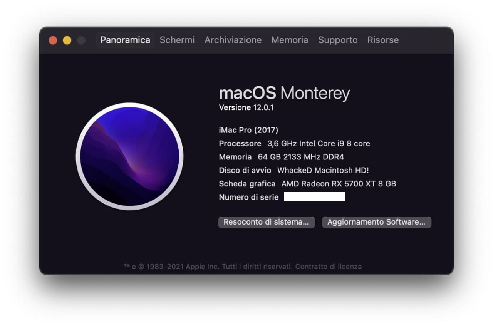
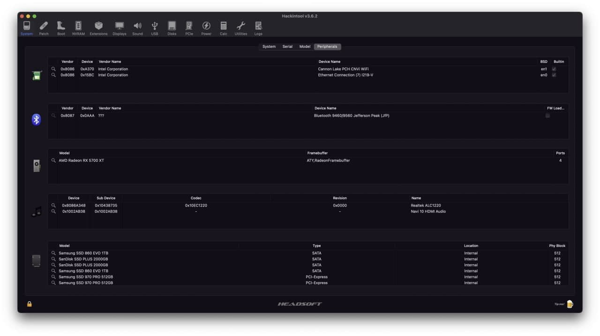
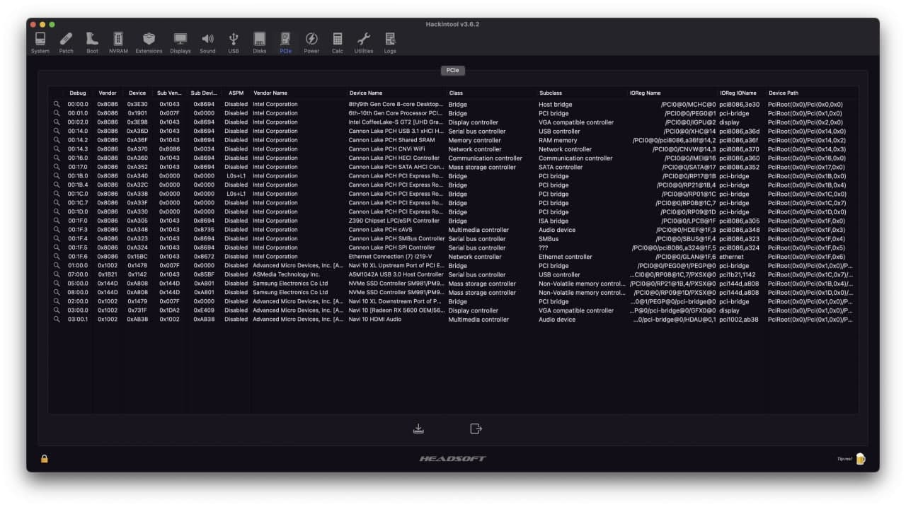
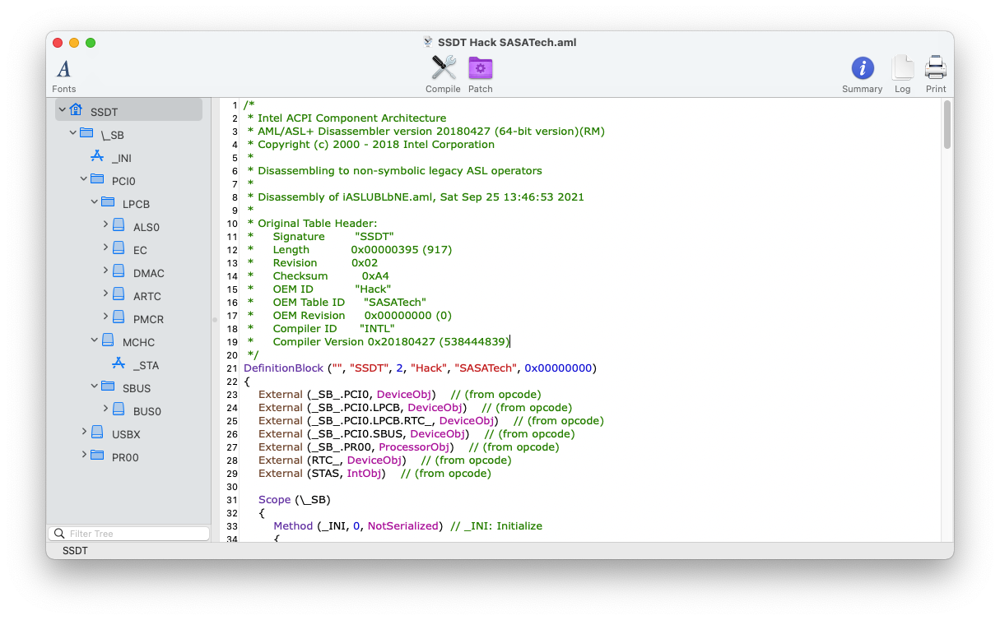

# ASUS ROG MAXIMUS XI CODE Z390 Hackintosh

#### *Read this in other languages: [English](README.EN.md).* 🇺🇲 (Writing... :pen: )

# Italian Repository :it: 
### macOS Monterey correttamente installato su ASUS ROG MAXIMUS XI CODE Z390

# Specifiche:

| Componenti       | Modello                            |
| ---------------- | ---------------------------------- |
| Scheda Madre     | ASUS ROG MAXIMUS XI CODE Z390      | 
| CPU              | Intel i9 9900K                     | 
| iGPU             | Intel® UHD Graphics 630            |
| dGPU             | AMD Radeon RX 5700 XT              |
| Audio            | ALCS1220                           |
| WiFi + Bluetooth | Intel® Wireless-AC 9560            |
| RAM              | 64 GB DDR4 2133 Mhz                |
| NVMe             | Samsung MZ-V7P512BW                |
| SMBIOS           | iMacPro1,1                         |
| Bootloader       | OpenCore 0.7.4                     |

## Di default la GUI di OC è impostata in 1920x1080.
Se avete una risoluzione diversa, recatevi in EFI > OC, cancellate la cartella Resources e scompattate quella che vi interessa.

## NOTE:
Kexts aggiornati alle ultime versioni.
Se volete installare Big Sur, in post installazione sostituite il kext Airportitlwm con la versione per Big Sur, in più togliete BlueToolFixup e aggiungete IntelBluetoothInjector.
Se volete utilizzare la iGPU, rinominate config-igpu.plist in config.plist.
Se non utilizzate una scheda grafica AMD della serie NAVI, togliete il bootarg __agdpmod=pikera__

# Impostazioni Bios

## Disabilita:

- Fast Boot
- VT-d
- CSM
- Intel SGX
- Intel Platform Trust
- CFG Lock (MSR 0xE2 write protection)

## Abilita:

- Intel Virtualizzation Technology
- Above 4G decoding
- Hyper-Threading
- Execute Disable Bit
- EHCI/XHCI Hand-off
- OS type: (Windows 10 Feautres: Windows 8/10 WHQL oppure Other)
- DVMT Pre-Allocated(iGPU Memory): 64 MB
- DVMT Total Gfx Mem → MAX

## Impostazioni generiche, potresti non trovarne alcune.
  
# Dispositivo Screenshot

# Cosa funziona e cosa no:
- [ ] Intel UHD 630 iGPU (Headless)
- [x] AMD Radeon RX 5700 XT
- [x] ALCS1220 Uscite interne
- [x] ALCS1220 HDMI Audio Output
- [x] Porte USB
- [x] Intel® Wireless-AC 9560
- [x] Intel® I219V LAN
- [x] NVRAM
- [x] Avvio Windows da OpenCore

# Sezione Info SSDT ASUS ROG MAXIMUS XI CODE Z390

## Crediti

- [Acidanthera](https://github.com/acidanthera) per OpenCore Bootloader
- [Apple](https://apple.com) per macOS;
- [HackintoshLifeIT](https://github.com/Hackintoshlifeit) Gruppo di supporto pre e post Installazione
- [Dortania](https://github.com/dortania) per le guide OpenCore.

# Se avete bisogno di aiuto contattateci su [Telegram](https://t.me/HackintoshLife_it)
